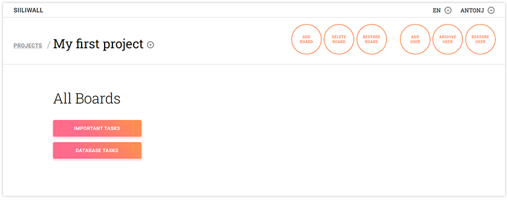
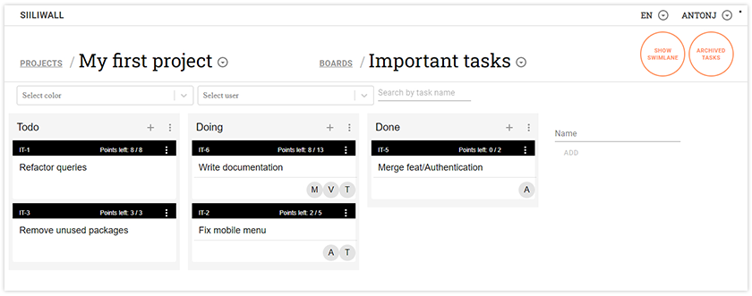
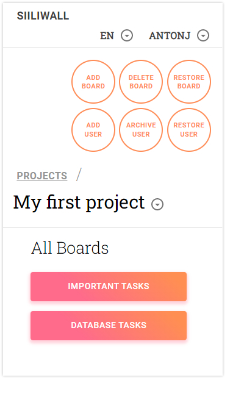

## About SiiliWall

SiiliWall is a project management tool for Siili Solutions Oy. The project started in January 2020, after which it has been developed by four separate teams.
The project's main purpose is to act as a simplified Kanban-board in which the user can create columns for stickies on a board and to eliminate the need for flip chart setups to save time and workspace in agile IT-projects without excessive configurations.

The stickies represent tasks and can be moved between columns by dragging and dropping. The tasks of the board can be visualized in typical Kanban board or by swimlane view where you can see the lifecycle of the tasks and their subtasks more clearly.

## Installation
#### Prerequisites 
- Git installed on your computer. [Download Git](https://git-scm.com/downloads)
- Node (14.16.1) installed on your computer. [Download Node](https://nodejs.org/en/download/)
- Docker installed on your computer. [Download Docker](https://www.docker.com/products/docker-desktop)
- Clone the project to your local machine from the GitHub by clicking the clone button.

#### Setting up the development database
1. After cloning the repository run `npm install` in root folder and in the server folder.
2. You can start front end with `npm run start`
3. Launch Docker. Open new terminal. Navigate to server folder and run `docker-compose up phpmyadmin db`. It will start ports 8081 and 3306.
4. Open new terminal. Navigate to server folder and run `npm run start:dev`. It will start 4001. This action will also synchronize the tables of the database according to the sequelize's models and insert some development data into them. 
5. You are all setup now and can test the GraphQl API from `localhost:4001/graphql`.

The front-end starts from `localhost:3000` and the phpmyadmin database is accessible through `localhost:8081`. Both the username and password for phpmyadmin are `root`.